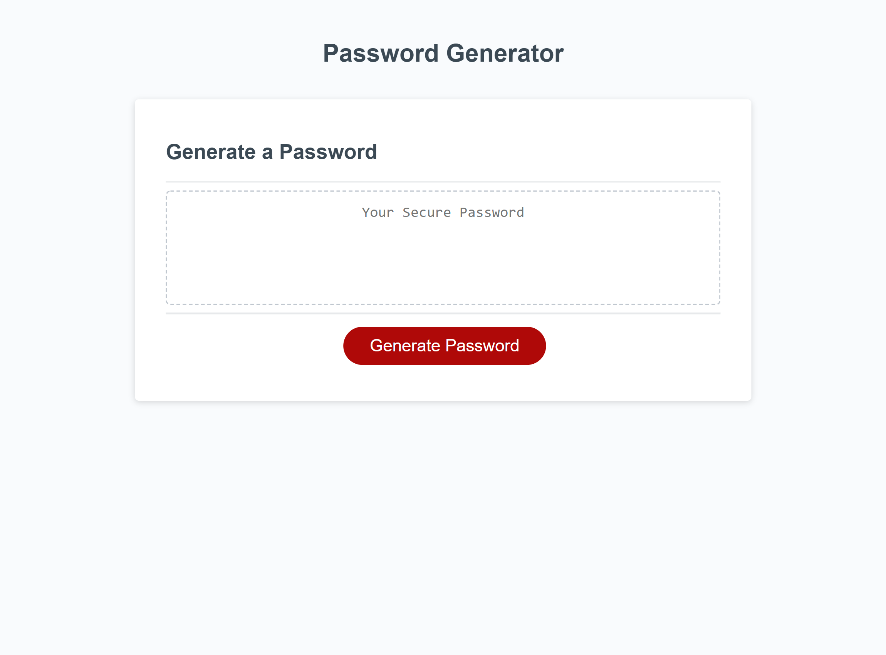

This week, we were tasked with creating a random password generator. For this assignment, we were given a both index.html and style.css files, which needed no changes, and a script.js file which contained the beginning of the password generation function, and we needed to complete the function. 

This generator needs to accept input from the user about how long they would like the password to be, and what kinds of characters they would like to include in their password. The function begins with a while loop and a window prompt, which asks the user how long they'd like their password to be, with the conditions that it must be within 8 and 128 characters long. The function then goes through four separate if loops, which ask the user if they'd like to include lowercase letters, uppercase letters, numbers, and special characters. If the user selects yes for any of these, the function pulls a random element from the respective arrays of these elements, and adds that element to the password, while also adding the full array to a new, empty array, called fullChar. 

Once the initial elements have been selected and fullChar has been filled, a mathematical expression is evaluated, which calculates the difference between how many characters the user requested, and how many characters have been placed into the password based on the Boolean values of the previous if loops. This value, called remaining, is then placed into a for loop, where that number of random elements is selected from the fullChar array and added to the password array. 

I have also included an if statment for the null case where a user declines to include any of the four character types in their password, which obviously negates a password from being created. Under these empty array conditions, and alert pops up for the user, telling them characters must be selected, and prompting them to begin the password generation process again.

Finally, the password array is converted into a string and then given to the user. 

My final webpage looks like 

And my live website can be viewed by following [this link.](https://elarso2.github.io/Password-Generator/)